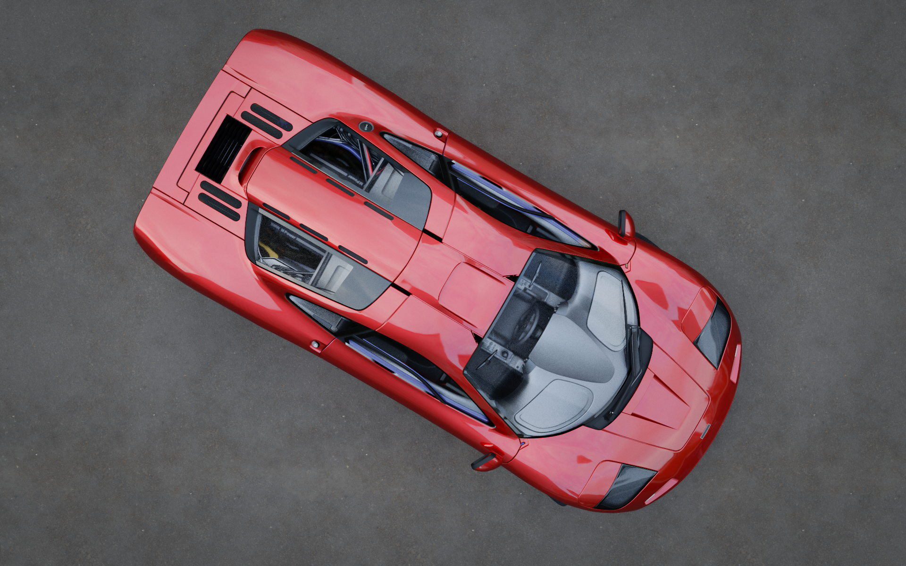
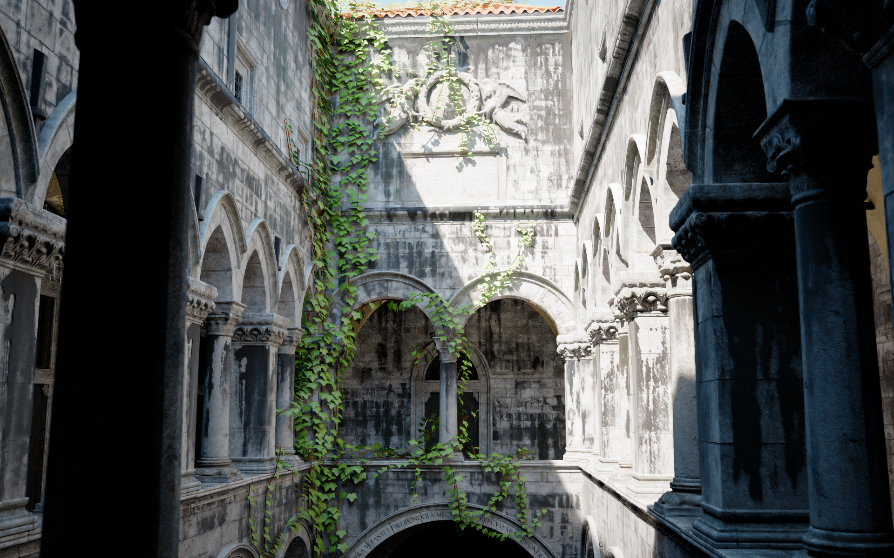
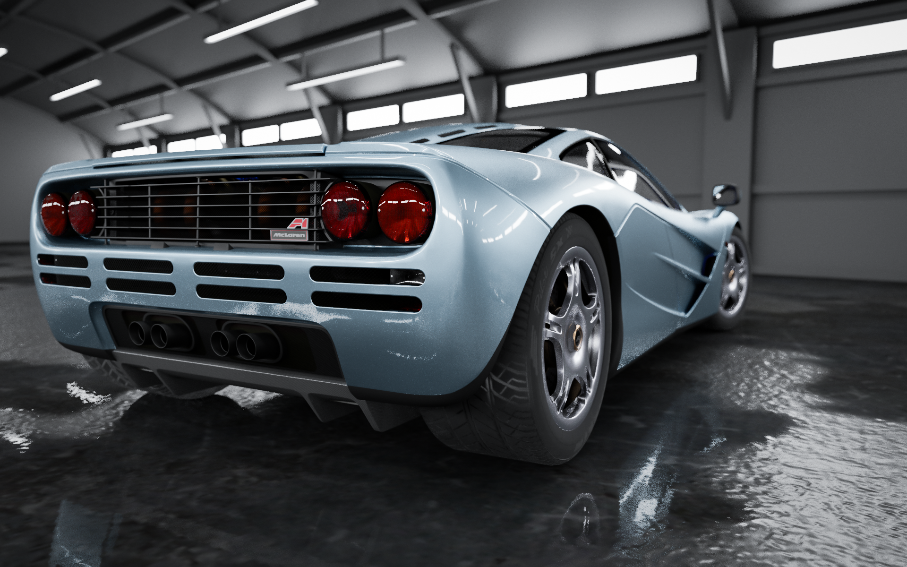

# yart – Yet Another Ray Tracer

|    |     |
|----------------------------------------|----------------------------------------------|
|  |  |

yart is a simple CPU path tracer written in C++ using minimal dependencies. All rendering code is written from scratch,
since the project is intended as a way to teach myself path tracing techniques and implementation. Loosely based on the
methods described in [PBR book](https://pbr-book.org/4ed/contents).

The renderer supports scenes in the GLTF format.

## Building and running

The project uses CMake, and should build with any supported build system. While the renderer itself is platform
agnostic, the SDL2/Metal frontend uses the Metal API and will only build on macOS, so you will need to disable it in
order to build for a different system.

There is no CLI interface at the moment as usability was not a priority during development. Unfortunately, that means
you'll have to edit `main.cpp` and rebuild to change scene or render settings.

### Dependencies

The project uses a few dependencies. Included in source:

- [metal-cpp](https://github.com/bkaradzic/metal-cpp) for Metal API compatibility
- [stb_image](https://github.com/nothings/stb/blob/master/stb_image.h) for texture loading
- [xoshiro_cpp](https://github.com/david-cortes/xoshiro_cpp) for RNG (currently unused)

Not included:

- [fastgltf](https://github.com/spnda/fastgltf/) is used for loading GLTF files. Simply place the source distribution in
  a `fastgltf` directory in the project root, any version after `0.8.0` should work.
- SDL2, the CMakeLists looks for it in the homebrew install dir. If using from another source modify CMakeLists
  accordingly. Since it's only used for the macOS frontend the dependency can be safely removed on a different OS.

## Features

- Backwards path tracing using MIS+NEE and arbitrary area light sampling
- Supports a parametric PBR material loosely based on Enterprise PBR, with a glossy, metallic or dielectric base and
  clearcoat layer
- Textures for most material parameters and normal mapping
- Multiple scattering compensation for GGX microfacet BSDFs
- Simple non-scattering volumes
- Environment maps with importance sampling (see Sponza renders above, lit exclusively by environment map)
- Decently fast SAH BVH acceleration structure (bottom-level only)
- Lens depth of field effect
- AGX tonemapping
- Tile based multi threaded rendering
- Progressive rendering in "waves"
- Median of means and GMoN accumulators to prevent fireflies

## What it doesn't do

- Scattering volumes
- Subsurface scattering
- Non-geometry lights (directional, point, spot, etc)
- Light BVH for scenes with a large number of lights
- Adaptive sampling
- Fancier light transport: BDPT, MLT, ReSTIR...